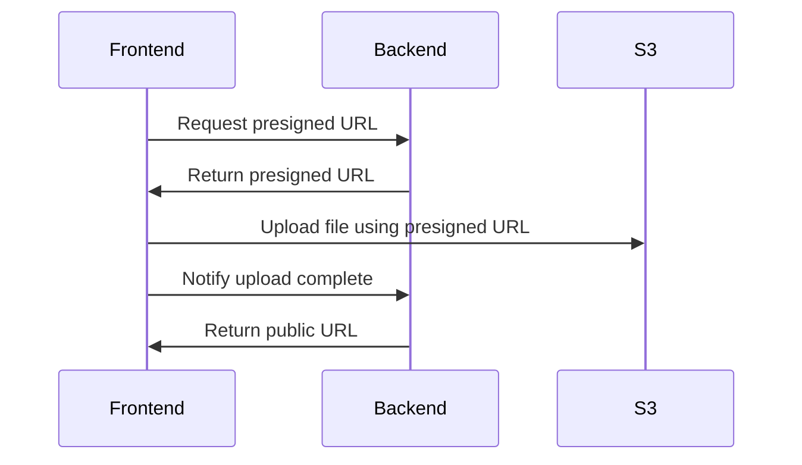
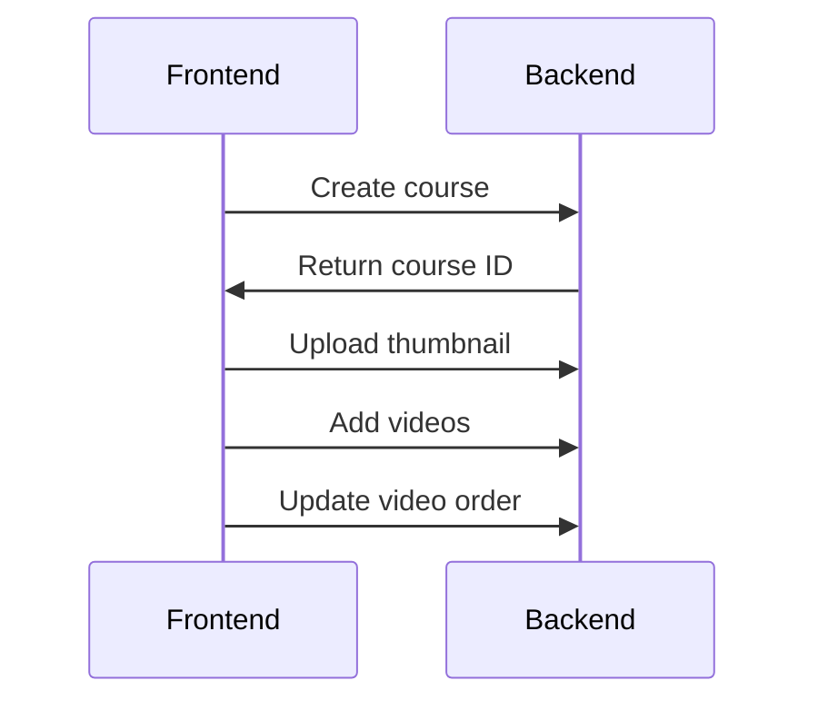
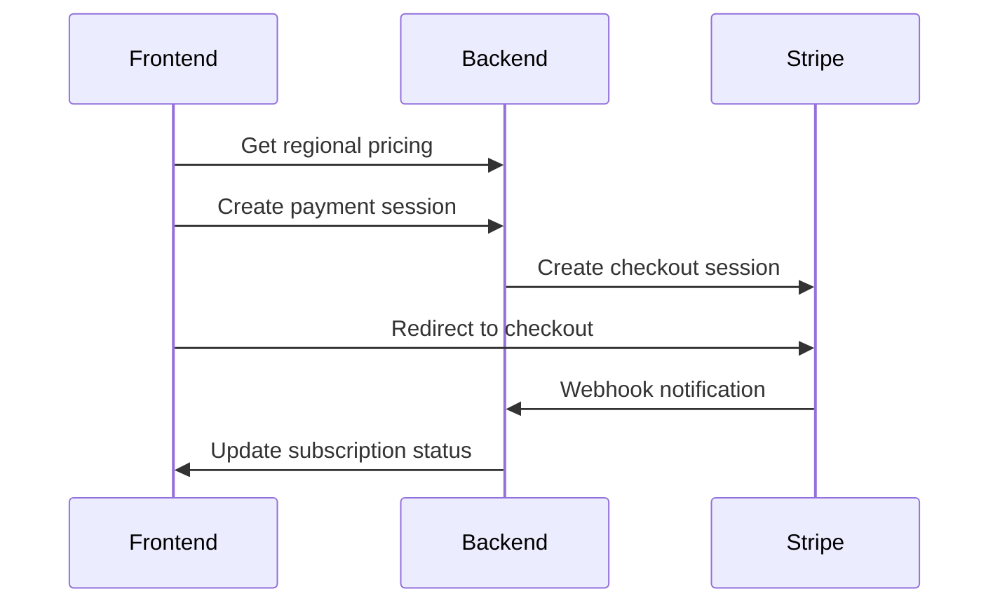

# Course Platform API Documentation

## Overview
This is a backend API for a course platform that allows users to create, manage, and consume educational content. The platform supports video courses, user subscriptions, and payment processing.

## Core Features

### 1. Authentication & User Management
- User registration with email verification
- Login with JWT authentication
- Password reset functionality
- User profile management
- Role-based access control (Admin/User)

### 2. Course Management
- Create, read, update, and delete courses
- Course metadata (title, description, thumbnail, etc.)
- Course categorization with skills
- Video ordering within courses
- Paid/Free course distinction

### 3. Video Management
- Upload videos and thumbnails to S3
- Video metadata management
- Watch history tracking
- Progress tracking
- Video ordering within courses

### 4. Subscription & Payment
- Regional pricing support
- Monthly/Yearly subscription plans
- Stripe integration for payments
- Subscription management
- Payment history

### 5. Admin Features
- User management
- Course moderation
- Payment tracking
- Regional pricing management
- User statistics

## API Endpoints

### Authentication
```
POST /api/auth/register
POST /api/auth/login
POST /api/auth/verify-otp
POST /api/auth/request-reset
POST /api/auth/reset-password
```

### User Management
```
GET /api/users/me
PUT /api/users/me
GET /api/users (admin only)
PUT /api/users/:id (admin only)
DELETE /api/users/:id (admin only)
```

### Course Management
```
GET /api/courses
POST /api/courses
GET /api/courses/:id
PUT /api/courses/:id
DELETE /api/courses/:id
POST /api/courses/:id/reorder
POST /api/courses/:id/videos
DELETE /api/courses/:id/videos/:videoId
```

### Video Management
```
GET /api/videos
POST /api/videos
GET /api/videos/:id
PUT /api/videos/:id
DELETE /api/videos/:id
POST /api/videos/presigned-url
POST /api/videos/upload-complete
PUT /api/videos/:id/watch-history
GET /api/videos/watch-history
```

### Subscription & Payment
```
GET /api/payments/regional-pricing
POST /api/payments/create
GET /api/payments/:id
GET /api/payments
POST /api/subscriptions
GET /api/subscriptions/:id
GET /api/subscriptions
PUT /api/subscriptions/:id/cancel
PUT /api/subscriptions/:id/payment-method
PUT /api/subscriptions/:id/reactivate
```

## Frontend Development Guide

### Required Environment Variables
```env
VITE_API_URL=http://localhost:8080
VITE_STRIPE_PUBLIC_KEY=your_stripe_public_key
```

### Key Frontend Features to Implement

1. **Authentication Pages**
   - Registration with email verification
   - Login
   - Password reset flow
   - Protected routes

2. **Course Management**
   - Course listing with filters
   - Course creation/editing form
   - Video upload interface
   - Course preview

3. **Video Player**
   - Custom video player with progress tracking
   - Thumbnail preview
   - Watch history integration

4. **Subscription Management**
   - Subscription plans display
   - Payment integration with Stripe
   - Subscription status and management

5. **Admin Dashboard**
   - User management interface
   - Course moderation tools
   - Payment tracking
   - Analytics dashboard

### Frontend Technologies Recommended
- React/Vue.js for the frontend framework
- Tailwind CSS for styling
- React Query/SWR for data fetching
- React Router for routing
- Zustand/Redux for state management
- Video.js for video player
- Stripe.js for payment integration

### API Integration Flow

1. **Video Upload Flow**


2. **Course Creation Flow**


3. **Subscription Flow**


### Security Considerations
1. Implement proper JWT token storage
2. Use HTTPS for all API calls
3. Implement rate limiting
4. Sanitize user inputs
5. Handle file upload size limits
6. Implement proper error handling

### Performance Optimization
1. Implement video streaming
2. Use lazy loading for course listings
3. Implement proper caching strategies
4. Optimize image and video thumbnails
5. Use pagination for large data sets

## Development Setup

### Backend Requirements
- Go 1.24 or higher
- MongoDB
- AWS S3 account
- Stripe account

### Frontend Requirements
- Node.js 16 or higher
- npm/yarn
- Modern web browser

### Local Development
1. Clone the repository
2. Set up environment variables
3. Install dependencies
4. Run database migrations
5. Start the development server

## Deployment Considerations
1. Set up proper CORS configuration
2. Configure AWS S3 bucket policies
3. Set up Stripe webhook endpoints
4. Configure proper security headers
5. Set up monitoring and logging
6. Implement backup strategies

## Testing
1. Unit tests for core functionality
2. Integration tests for API endpoints
3. E2E tests for critical user flows
4. Load testing for video streaming
5. Security testing

## Monitoring and Maintenance
1. Set up error tracking
2. Monitor API performance
3. Track user engagement metrics
4. Monitor payment processing
5. Regular security audits 